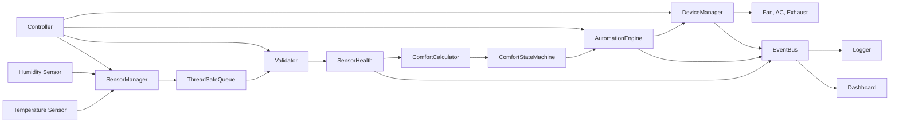
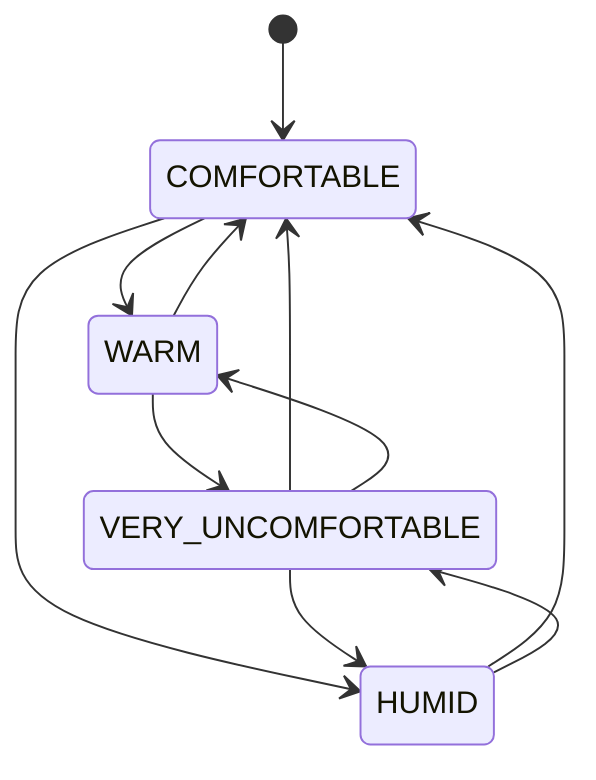
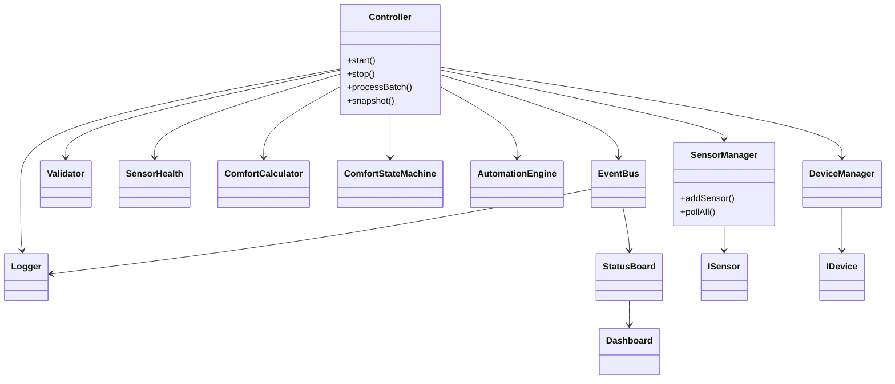
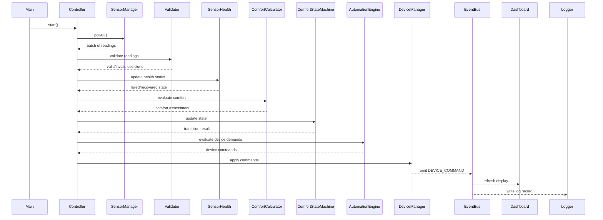

# ClimaSense Architecture

## Overview

ClimaSense is a software-only home comfort controller that monitors temperature and humidity, classifies current comfort, and automatically drives a virtual Fan, AC, and Exhaust. The design is intentionally layered so that the control logic is independent from the physical hardware and can later be connected to real Arduino-like sensors and relays without rewriting the core application.

The system behaves like a closed control loop:

1. Sensors collect readings.
2. Readings are validated and time-stamped.
3. Sensor health is tracked.
4. Comfort is estimated from temperature and humidity.
5. Device commands are derived from the comfort state.
6. Events are logged and shown in a live dashboard.

---

## Architectural goals

- Safe operation under bad sensor data
- Minimal shared state between threads
- Clear separation between hardware interfaces and control logic
- Deterministic automation decisions with hysteresis
- Live monitoring and event logging
- Easy replacement of simulated hardware with real devices

---

## High-level system structure

The system is organized as a pipeline of responsibilities. Each layer communicates only with its direct neighbor, and hardware access is abstracted behind interfaces.

### Interface-based design

Hardware boundary is separated through interfaces such as:

- `ISensor` for temperature and humidity sensors
- `IDevice` for Fan, AC, and Exhaust devices

This means the automation logic does not know whether a device is virtual or physical. A real sensor or relay can be substituted behind the same contract later.

---

## Core components

| Component | Responsibility |
|---|---|
| `TemperatureSensor` / `HumiditySensor` | Produce simulated readings with drift and noise |
| `FaultySensor` | Wraps a sensor and injects failure patterns |
| `SensorManager` | Collects all sensor values and timestamps them |
| `ThreadSafeQueue` | Transfers sample batches from sensor thread to control thread |
| `Validator` | Rejects impossible, stale, or repeated readings |
| `SensorHealth` | Tracks bad and good streaks, declares failure or recovery |
| `ComfortCalculator` | Maps values to comfort categories and thresholds |
| `ComfortStateMachine` | Maintains the current comfort state with hysteresis |
| `AutomationEngine` | Turns comfort state into commands for devices |
| `DeviceManager` | Owns the device list and applies commands |
| `EventBus` | Publishes state, sensor, and device events |
| `Logger` | Records events in `climasense.log` |
| `StatusBoard` / `Dashboard` | Maintains live statistics and terminal UI |
| `Controller` | Owns the pipeline, threads, and orchestration |

---

## Data flow pipeline

The runtime pipeline is intentionally simple and one-directional:

1. The sensor thread polls each sensor at a fixed interval.
2. Readings are grouped into a batch and queued for the control thread.
3. The control thread validates each sample.
4. Invalid readings do not change the comfort state immediately.
5. Sensor health is updated using a fail/recover debounce.
6. Valid readings are analyzed by the comfort calculator.
7. The comfort state machine evaluates the overall room condition.
8. The automation engine translates the state into device actions.
9. The device manager applies those actions only when the command actually changes.
10. Events are emitted to the logger and dashboard.

This is a classic control loop: sensor input -> validation -> health -> comfort classification -> actuation -> reporting.

---

## Threading and concurrency model

The application uses a small number of cooperating threads to keep sensor input, control logic, and display independent.

| Shared data | Written by | Read by | Protection |
|---|---|---|---|
| Sample queue | Sensor thread | Control thread | `std::mutex` + `std::condition_variable` |
| Status board | Control thread, main thread | Dashboard thread, main thread | mutex + snapshot copy |
| Sensor targets / fault mode | Main thread | Sensor thread | `std::atomic` |
| Pipeline state | Control thread only | None | no locking needed |

### Thread responsibilities

- Sensor thread: polls temperature and humidity sensors every 200 ms
- Control thread: validates readings and runs the full comfort pipeline
- Dashboard thread: renders the terminal display every 500 ms from a snapshot
- Main thread: drives the simulation and fault injection

The design rule is to minimize shared mutable state. Most of the system is owned by the control thread, which makes the logic easier to reason about and safer under concurrency.

---

## Sensor validation and fault handling

A reading is considered invalid if it is one of the following:

- not a number
- outside the plausible range
- too old to trust
- repeated too many times in a row

The project adopts a fail-safe strategy:

- One bad reading does not immediately change control behavior.
- Three bad readings in a row trigger a sensor failure.
- When a sensor fails, all devices are switched off.
- The comfort state is frozen at its last known value.
- After three good readings in a row, the sensor is marked recovered.
- Automation resumes automatically once the sensor is healthy again.

This protects the system from false positives and from wild sensor values that could otherwise cause the AC or fan to run endlessly.

---

## Comfort calculation and hysteresis

Comfort is derived from temperature and humidity together. The system classifies both inputs as normal or high, and then maps them to a higher-level comfort state.

| Temperature level | Humidity level | Comfort state |
|---|---|---|
| NORMAL | NORMAL | COMFORTABLE |
| HIGH | NORMAL | WARM |
| NORMAL | HIGH | HUMID |
| HIGH | HIGH | VERY_UNCOMFORTABLE |
| VERY_HIGH | any | VERY_UNCOMFORTABLE |

The system also applies hysteresis so that device states do not chatter around thresholds. For example, a device turns on when a threshold is crossed, but it does not turn off until the reading goes below the threshold minus a configured hysteresis margin.

Default thresholds:

- Temperature >= 28.0°C => Fan ON
- Temperature >= 33.0°C => AC ON, with fan still active
- Humidity >= 70.0% => Exhaust ON

---

## Automation logic

The `AutomationEngine` is responsible for converting the comfort assessment to actual device actions. It does not blindly turn devices on and off. Instead, it compares the requested state to the current device state and emits commands only when there is an actual change.

This prevents unnecessary toggling and reduces wear on virtual devices.

### Device rules

- Fan: enabled when temperature is high
- AC: enabled when temperature is very high
- Exhaust: enabled when humidity is high
- Fail-safe: all devices turn off when a sensor fails
- Fan and AC interaction: the fan may remain on while the AC is active according to configuration

---

## State model

The comfort layer is governed by a finite-state machine.

The machine tracks the current comfort state and stores how many times the state has changed. Device decisions and event logging are derived from that state.

---

## Event-driven monitoring

The application emits several event types through the `EventBus`:

- `SYSTEM_STARTED`
- `STATE_CHANGED`
- `SENSOR_INVALID`
- `SENSOR_FAILED`
- `SENSOR_RECOVERED`
- `DEVICE_COMMAND`

Subscribers include:

- `Logger`: writes events to `climasense.log`
- `StatusBoard`: updates statistics and recent activity
- `Dashboard`: renders the live terminal status view

This decouples the decision-making logic from the reporting layer and allows the system to monitor itself from a single event stream.

---

## Class relationships

---

## Sequence diagram

---

## Configuration model

The application reads configuration from `climasense.conf` and validates each value before use. Missing entries keep defaults, while malformed lines are reported with their source line number.

Key configurable items include:

- `temp_high`
- `temp_very_high`
- `humidity_high`
- `hysteresis`
- `fan_runs_with_ac`

This keeps the comfort logic adjustable without changing the C++ code. It also allows the application to run in different environments or with different comfort preferences.

---

## Safety and resilience design

ClimaSense is designed to degrade gracefully when conditions become unrealistic:

- impossible readings are ignored
- stale data is rejected
- repeated data is treated as suspicious
- failed sensors force a safe shutdown
- the system recovers when enough good readings return
- automation never runs from untrusted sensor input

This makes the system robust enough for real-world automation scenarios where sensor faults are common and safety matters more than maximizing output.

---

## Why this architecture works

The architecture is effective because it separates concerns cleanly:

- sensors only produce values
- validation checks correctness
- health logic decides trustworthiness
- comfort logic decides room condition
- automation decides device action
- event and dashboard layers report outcomes

This separation gives the project three major advantages:

1. easier reasoning and testing,
2. better fault tolerance,
3. safer hardware substitution later.

---

## Summary

ClimaSense is a layered, event-driven, fail-safe comfort control system. It uses a thread-based architecture to isolate sensor polling, control logic, and dashboard rendering, while relying on validation, health tracking, and hysteresis to maintain correct and safe operation. The design intentionally separates hardware interfaces from control logic so the software can eventually be connected to real industrial or Arduino-style sensors and actuators without major redesign.
